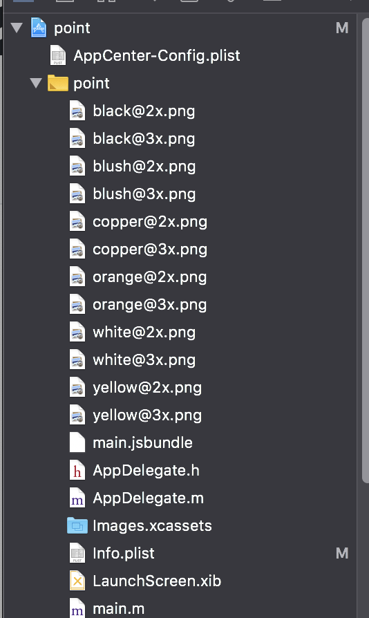
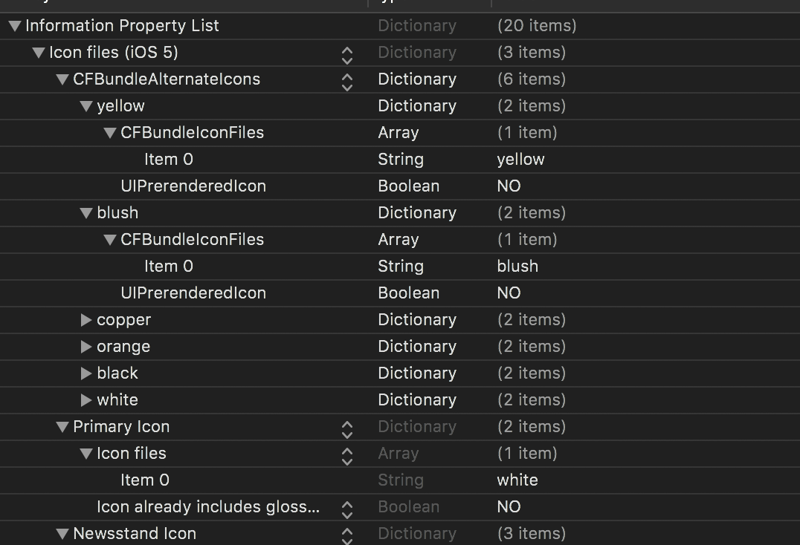

# react-native-set-app-icon

## Getting started

`$ npm install react-native-set-app-icon --save`

### Mostly automatic installation

`$ react-native link react-native-set-app-icon`

## IOS

Setup XCode

Put all your image as `@2x.png` `@3x.png` in the root of your project setups



After this go in your `Info.plist` and follow this image setup.



## Usage

```javascript
import SetAppIcon from "react-native-set-app-icon";
```

### changeAppIcon

Promise who return a boolean. Take the iconName name set in your config.

```js
SetAppIcon.changeIcon(iconName: string): Promise<boolean>;
```

If you want to set the default back just use `null`

```js
SetAppIcon.changeIcon(null);
```

### getIconName

Take a callback and receive an object with iconName in it.

```js
SetAppIcon.getIconName(cb: (icon: { iconName: string }) => void): void;
```

### supportsDynamicAppIcon

Return a Promise with a boolean if the device accept the dynamic app icon change.

```js
SetAppIcon.supportsDynamicAppIcon(): Promise<boolean>;
```
